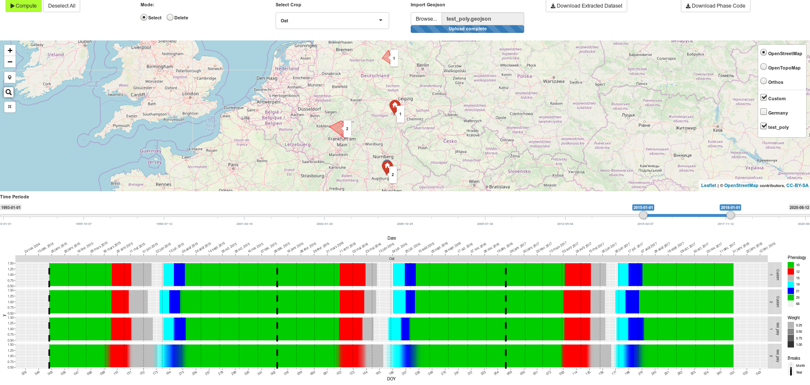
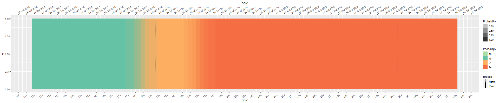

<style>
img + em { display: block; text-align: center;}
</style>
# PhenoWin
Shiny application to draw phenological windows  

## Setup
### Input Geotif Files
The folder **_DOY** must contain the input geotif files. Its name is format
*DOY_[3 digit crop code]-[1 or 2 digits phonology code]_[4 digit year].tif*.

For example:

```
DOY_201-1_1993.tif
DOY_201-1_1997.tif
```
### Data Generation
Launch **Extract_Pheno_Shapefile.R** to generate in the data used by the app in
the **_Data** folder.
## Usage
Launch **Graph_Pheno.R** to start the app.


*screenshot of the app*
### Data selection

The *Mode* radiobutton enable two modes:
+ Point mode:  
  The user click on the map to choose the pixel from where the data must be taken.
  The data extraction can take a long time.
+ Zone mode:  
  The user click on one of the zone displayed on the map. The data have been previously processed and aggregated by the **Extract_Pheno_Shapefile.R** script. Because of that, the
  data extraction is faster in this mode than in the point mode.

### Phenologyical windows graph
The graph is drawn according to the data selected by the user. Its limits are
determined by the time slider.  
Each phenological window is drawn on top of the previous one. The alpha value
correspond to the probability that the phenological stage have been reached.
Considere the following example:

In 2010, The phase 21 start on 24/06 and end on the 16/07. Nevertheless, the
phase 24 start on 09/07. The overlapping period from 09/07 to 16/07 can be
visualised with the transparence of the phase 24. the transparence value is
the proportion of pixel in the area that reached the phase 24.
