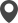

# PhenoWin
Visualisation of phenological windows in Germany

## Setup
### Input Geotif Files
The folder **_DOY** must contain the input raster files. There names are in format
*DOY_[3 digit crop code]-[1 or 2 digits phenology code]_[4 digit year].tif*.

For example:
```
DOY_201-1_1993.tif
DOY_201-1_1997.tif
```
+ The crop code can be found in the **crops.csv** file.
+ The phase code can be found in the **Phases.csv** file.
+ The value in the cells are the Day Of the Year of the phase transition.
### Generation of the velox objects
Launch **Extract_Pheno_Shapefile.R** to generate the velox objects used by the app in
the **_Data** folder. It can take some time, depending of the number of input rasters.
## Usage
Launch **Graph_Pheno.R** to start the app.


*screenshot of the app*

On the left of the map, 3 different base maps are available. Each time the user import data, it creates a new group visible below the basemap selector. Inside a group, each spatial entity have a unique ID labeled on the map. The group name and the ID are used on the graph to identify each area.

### Creation of spatial entities
There are two ways to create spatial objects:
+ By clicking on the  button (on the left of the map). The user can then click on the map where the point have to be created.
+ By clicking on the **import Geojson** button. The user can then import spatial points or spatial polygons.

### Selection of spatial entities

The **Mode** radiobutton enable two modes:
+ *Select mode*:
  The user click on the entities of the map to select them. The selected red entities
  will be used to create the map.
+ *Delete mode*:
  The user click on an entity on the map to delete it.

### Phenological windows graph
When the spatial entities and the crop are selected, the user can click on the **compute** button to create the graph.
The graph is drawn according to the data selected by the user. Its limits are
determined by the time slider.  
Each phenological window is drawn on top of the previous one. The alpha value
correspond to the proportion of pixel that reached a phenological phase.
The name of the studied zone is written on the right of the graph.


# R packages
+ tidyverse
+ scales
+ lubridate
+ shiny
+ leaflet
+ leaflet.extras
+ raster
+ sf
